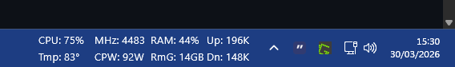
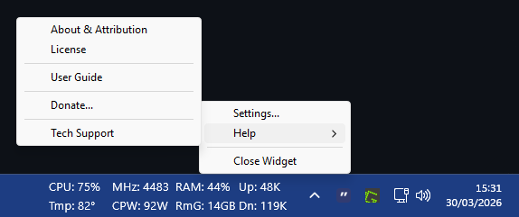
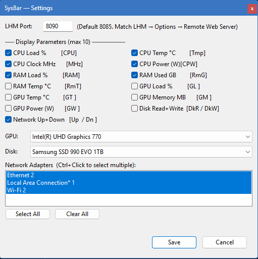

# SysBar — Real-Time Hardware Monitor for Windows

**Live CPU, GPU, RAM, Network and Disk stats — right on your Windows taskbar.**

SysBar is a lightweight, transparent taskbar widget that displays real-time hardware sensor data directly alongside your system clock. No overlay windows, no floating panels — just clean, always-visible stats that feel native to Windows.

## SysBar Preview

### Main Window

### Menu

### Settings

---

## Links

| | |
|---|---|
| **Website** | [mrwizard2u.github.io](https://mrwizard2u.github.io/) |
| **Privacy Policy** | [mrwizard2u.github.io/privacy.html](https://mrwizard2u.github.io/privacy.html) |
| **License** | [mrwizard2u.github.io/license.html](https://mrwizard2u.github.io/license) |
| ☕ **Support the Project** | [mrwizard2u.github.io/donate.html](https://mrwizard2u.github.io/donate.html) |

---

## Features

- **Taskbar-native display** — sits permanently to the left of the notification area, exactly like the Windows clock
- **Real-time sensor data** — updates every 2 seconds with zero perceptible CPU impact
- **Fully configurable** — choose exactly which parameters to display via right-click Settings
- **Smart column layout** — related parameters pair automatically (CPU load + temp, RAM load + used GB); network and disk always anchor the right side
- **Automatic sensor discovery** — detects your hardware configuration from LibreHardwareMonitor at runtime; works across CPU vendors, GPU vendors, and LHM versions without reconfiguration
- **Per-pixel transparency** — GPU-composited via DirectComposition; zero background flicker
- **Multi-GPU support** — select your preferred GPU from a live dropdown in Settings
- **Multi-disk support** — select which disk to monitor from a live dropdown in Settings
- **Network aggregation** — automatically sums all physical network adapters into a single Up/Down figure; virtual, Bluetooth and tunnel adapters excluded
- **Single instance** — launching a second copy brings the existing widget to focus instead of spawning a duplicate
- **No ads. No telemetry. No internet access.** All data comes from your local LibreHardwareMonitor instance.

---

## System Requirements

| Requirement | Minimum |
|---|---|
| Operating System | Windows 10 version 1809 or later |
| Architecture | x64 |
| RAM | 50 MB available |
| GPU | Any — DirectX 11 hardware or software (WARP) fallback |
| Display | Any resolution, any DPI scaling (96 %–200 %+) |
| Dependencies | LibreHardwareMonitor 0.9.3 or later |

---

## Prerequisites — LibreHardwareMonitor

SysBar reads sensor data from **LibreHardwareMonitor (LHM)**, which must be running on the same machine.

### Install LibreHardwareMonitor

1. Download from [Libre Hardware Monitor](https://librehardwaremonitor.net/) or the [GitHub releases page](https://github.com/LibreHardwareMonitor/LibreHardwareMonitor/releases)
2. Extract to any folder (e.g. `C:\Tools\LibreHardwareMonitor\`)
3. Run `LibreHardwareMonitor.exe` **as Administrator** — right-click → Run as administrator
   - Administrator rights are required for CPU power, some GPU sensors, and DIMM temperatures
4. In LHM: **Options → Remote Web Server → Run** (tick the checkbox)
5. Confirm the status bar shows: *Listening on port 8085*

> **Note:** The default LHM Remote Web Server port is 8085. If you have changed it, update the port in SysBar Settings to match.

### Auto-start LibreHardwareMonitor with Windows (recommended)

1. In LHM: **Options → Run On Windows Startup** — tick the checkbox
2. Because LHM needs Administrator rights, Windows UAC will prompt on each startup unless you configure Task Scheduler to run it elevated automatically

---

## Installation

### From Microsoft Store (recommended)

1. Search **"SysBar Hardware Monitor"** in the Microsoft Store
2. Click **Get**
3. Launch from Start Menu or search

### Direct download

1. Download `SysBar-1.1.4-x64.msix` from the [Releases page](https://github.com/MrWizard2U/SysBar/releases)
2. Double-click the `.msix` file and click **Install**
3. Launch from Start Menu

---

## Getting Started

1. Start LibreHardwareMonitor as Administrator with Remote Web Server enabled
2. Launch SysBar — the widget appears immediately to the left of your system clock
3. Right-click the widget → **Settings**
4. Select which parameters to display
5. Select your GPU and Disk device from the dropdowns
6. Click **Save**

The widget will begin showing live data within 2 seconds of the first successful poll.

---

## Configuration Guide

Right-click the widget to access the context menu:

| Menu Item | Action |
|---|---|
| Settings... | Opens the configuration panel |
| Help... | Opens this reference in a scrollable window |
| Close Widget | Exits SysBar |

### Settings Panel

**LHM Port** — The port SysBar uses to connect to LibreHardwareMonitor's Remote Web Server. Default is `8085`. Must match the port shown in LHM's status bar.

**Display Parameters** — Tick the parameters you want displayed. Each parameter shows its widget label in brackets for reference. Maximum 6 columns total.

**GPU** — Select which GPU to monitor. Populated live from LHM when Settings is opened. If the list shows "LHM offline", start LHM and reopen Settings.

**Disk** — Select which disk to monitor for read/write throughput. Populated live from LHM.

**Network Adapters** — Select which physical network adapters to include in the Up/Down aggregate. Use Ctrl+Click to select multiple. Select All / Clear All buttons available.

Click **Save** to apply. The widget resizes and updates immediately.

---

## Parameter Reference

### Widget Labels

| Label | Full Name | Unit | Notes |
|---|---|---|---|
| `CPU` | CPU Load | % | Total CPU utilisation across all cores |
| `Tmp` | CPU Temperature | °C | P-Core #1 (Intel) or Tdie (AMD) |
| `MHz` | CPU Clock | MHz | P-Core #1 frequency |
| `CPW` | CPU Package Power | W | Total CPU package power draw |
| `RAM` | RAM Load | % | Total physical memory utilisation |
| `RmG` | RAM Used | GB | Physical memory in use |
| `RmT` | RAM Temperature | °C | First DIMM module temperature |
| `GL` | GPU Load | % | 3D engine utilisation |
| `GT` | GPU Temperature | °C | GPU core temperature |
| `GM` | GPU Memory | MB | GPU memory in use |
| `GW` | GPU Power | W | GPU power draw |
| `Up/Dn` | Network Up + Down | B/s · KB/s · MB/s | Combined across selected adapters |
| `DkR/DkW` | Disk Read + Write | B/s · KB/s · MB/s | Selected disk throughput |

### Status Indicators

| Display | Meaning |
|---|---|
| `--` | LHM is offline or not reachable |
| `N/A` | Sensor not present on this hardware |
| `OFF` | No parameters selected |

### Value Formats

All values are capped at 4 characters. Speed values scale automatically:

- `999B` — bytes per second
- `9.9K` / `999K` — kilobytes per second
- `9.9M` / `999M` — megabytes per second
- `1.2G` — gigabytes per second

---

## Known Limitations

- **LHM must be running** — SysBar has no built-in sensor access; it depends entirely on LibreHardwareMonitor's Remote Web Server
- **LHM Administrator rights** — without them, CPU power, GPU sensors, and DIMM temperatures may be unavailable and show `N/A`
- **Intel iGPU temperature** — Intel integrated graphics (UHD series) do not expose a temperature sensor in LHM; `GT` will show `N/A` on these systems
- **AMD Zen 3/4 temperature** — sensor label varies by generation; may show `N/A` for up to 60 seconds on first run while sensor discovery completes
- **Third-party shells** — systems running non-Microsoft taskbar replacements (Stardock, ExplorerPatcher) may not position the widget correctly
- **Auto-hide taskbar** — the widget follows taskbar auto-hide behaviour but may have a brief delay on first show
- **Single display** — widget always appears on the primary display taskbar

---

## Building from Source

### Prerequisites

- Visual Studio 2022 (v17.10 or later) with:
  - **Desktop development with C++** workload
  - **Windows 10/11 SDK (10.0.26100.0 or later)**
- Windows 10 SDK minimum version `10.0.17763.0` (1809)
- No package manager or additional dependencies required — `json.hpp` is included in the repository

### Steps

1. Clone the repository
2. Open `SysBar.sln` in Visual Studio 2022
3. Set configuration to **Release x64**
4. **Build → Build Solution** (`Ctrl+Shift+B`)
5. Output: `x64\Release\SysBar.exe`

### Runtime dependencies

All DirectX components (`D3D11`, `DXGI`, `D2D1`, `DWrite`, `DirectComposition`) are inbox on Windows 10+. No redistribution required. The only external runtime requirement is LibreHardwareMonitor.

For full build documentation, architecture details, and contributing guidelines see [`DEVELOPER.md`](https://github.com/MrWizard2U/SysBar/blob/main/DEVELOPER.md).

---

## Privacy

SysBar does not collect, transmit, or store any personal data. It makes no outbound network connections. All sensor data is fetched from LibreHardwareMonitor running locally on the same machine via loopback (`127.0.0.1`).

Full privacy policy: [mrwizard2u.github.io/privacy.html](https://mrwizard2u.github.io/privacy.html)

---

## Support the Project

SysBar is free and open source. If you find it useful, consider supporting development:

[☕ Donate — mrwizard2u.github.io/donate.html](https://mrwizard2u.github.io/donate.html)

---

## Licence

Copyright © 2026 Mutant Wizard ([mrwizard2u.github.io](https://mrwizard2u.github.io/))

This software is provided under a custom MIT-based licence. You are free to use, copy, modify, and redistribute this software — including as part of a larger product or service — subject to the following conditions:

- The software in its **original unmodified form** may not be sold or distributed as a standalone commercial product without prior written permission from the author.
- All distributed copies must include this licence and the original copyright notice.
- All redistributions must credit the original author: ([Original software by Mutant Wizard](https://mrwizard2u.github.io))
- Modified versions must be clearly marked as changed.

See [License](https://mrwizard2u.github.io/license) for the full licence text.

---

## Credits

- **Author:** Mutant Wizard
- **Sensor data:** [LibreHardwareMonitor](https://github.com/LibreHardwareMonitor/LibreHardwareMonitor) — open source, licensed under MPL 2.0
- **JSON parsing:** [nlohmann/json](https://github.com/nlohmann/json) — open source, licensed under MIT
